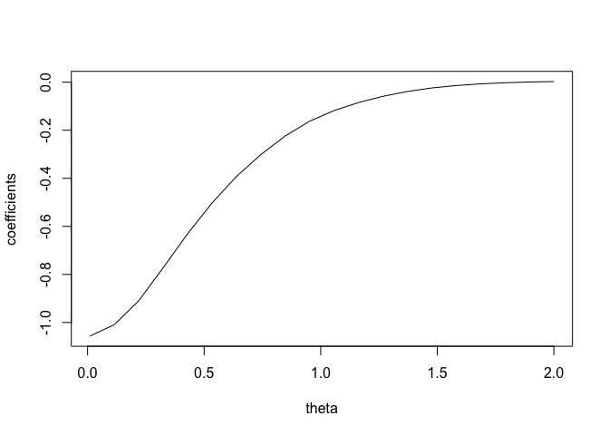

<!-- README.md is generated from README.Rmd. Please edit that file -->

# log.location

<!-- badges: start -->

<!-- badges: end -->

The goal of log.location is to …

## Installation

You can install the released version of log.location from
[CRAN](https://CRAN.R-project.org) with:

``` r
install.packages("log.location")
```

And the development version from [GitHub](https://github.com/) with:

``` r
# install.packages("devtools")
devtools::install_github("nilanjanalaha/log.location")
```

Let us simulate some Toy data

``` r
library(log.location)
x <- rgamma(1000, 1, 1)
```

## Beran (1974) ’s estimator : the fourier coefficients

The following function computes the Fourier coefficients of the scores.
Here theta is a tuning parameter which controls the precision of the
estimation and “indices” is the vector of indexes corresponding to the
basis functions.

``` r
score.coeff(x, theta=0.01, indices= c(1,2,4))
#>       real.part    im.part
#> [1,] -0.9199077 0.05526151
#> [2,] -1.0303782 0.08081560
#> [3,] -1.1483034 0.04213534
```

If we want only real parts or only imaginary parts, we can indicate so
by setting “which” to be one and two, respectively.

``` r
# To output only the real part of the cefficients
score.coeff(x, theta=0.01, indices= c(1,2,4), which=1)
#> [1] -0.9199077 -1.0303782 -1.1483034
```

We plot the real parts of the estimated Fourier coefficients as a
function of theta.


We repeat the same procedure for normal data. The true score for the
normal location odel is \(\Phi^{-1}(x)\) where \(\Phi\) is the standard
normal distribution function. We use the stats functon integrate to
calculate the imaginary part of its first Fourier coefficient (k=1). The
real part will be zero because standard normal density is symmetric
about 0.

``` r
f <- function(x) qnorm(x)*sin(2*pi*x)
val <- stats::integrate(f, 0, 1)$value
val
#> [1] -0.4638467
```

Overlaying the true value on the plot:

``` r
set.seed(5)
x <- rnorm(1000)
grid.theta <- seq(0.01, 0.5, length.out= 500)
reals <- sapply(grid.theta, score.coeff, x=x, indices=1, which=2)
plot(grid.theta, reals, xlab="theta", ylab="coefficients", type='l')
abline(h=val, col='blue')
```


The suggested value of theta in Beran (1974) is of order \(n^{-1/2}\).
We set \(\theta=cn^{-1/2}\). Let us plot the real part of the first
Fourier coefficient as a function of \(c\).


We observe that for Gaussian samples, \(cn^{-1/2}\) is not a very good
choice for \(\theta\). We consider k=3 now.

``` r
set.seed(8)
grid.theta <- seq(1, 100, by= 1)
reals <- sapply(grid.theta/sqrt(1000), score.coeff, x=x, indices=3, which=2)
plot(grid.theta, reals, xlab="c", ylab="coefficients", type='l')

f <- function(x) qnorm(x)*sin(2*3*pi*x)
val <- stats::integrate(f, 0, 1)$value
print(val)
#> [1] -0.2052047
abline(h=val, col='blue')
```


We run the same calculations by changing the seed.


Note that the previous c no longer works.

``` r
set.seed(1)
grid.theta <- seq(1, 100, by= 1)
reals <- sapply(grid.theta/sqrt(1000), score.coeff, x=x, indices=3, which=2)
plot(grid.theta, reals, xlab="c", ylab="coefficients", type='l')

f <- function(x) qnorm(x)*sin(2*3*pi*x)
val <- stats::integrate(f, 0, 1)$value
print(val)
#> [1] -0.2052047
abline(h=val, col='blue')
```

 It
seems that the estimates are more stable with larger values of k.

## Beran (1974) ’s estimator

Beran (1974)’s estimator is given by the function beran.est. This
function also computes \((1-\alpha)\%\) confidence intervals. If
\(\alpha\) is missing, 0.95\(%\) confidence intervals are calculated.
One important tuning parameter is the number of basis functions, which
is given by M. Below we plot the estimates given by Beran’s estimator
versus M for a standard logistic sample, whose location parameter
\(\theta\) is 0. The true value of \(\theta\) is given by the blue line.
The confidence intervals are in red.

``` r
set.seed(1)
grid.M <- seq(1, 20, by= 1)
#The data
x=rlogis(100)
est <- CI.lb <- CI.ub <- numeric(length(grid.M))

#The estimates
for(M in grid.M)
{
  est[M] <- beran.est(x, M=M)$estimate
  CI.lb[M] <- beran.est(x, M=M)$CI[,1]
  CI.ub[M] <- beran.est(x, M=M)$CI[,2]
}
  
plot(grid.M, est, xlab="M", ylab="The estimates", type='l', ylim=c(-2,2))

#Confidence intervals are in red
lines(grid.M, CI.lb, col='red')
lines(grid.M, CI.ub, col='red')
abline(h=0, col='blue')
```


We observe that the confidence intervals are too large for n=100. We try
n=1000, which still has high confidence intervals.

